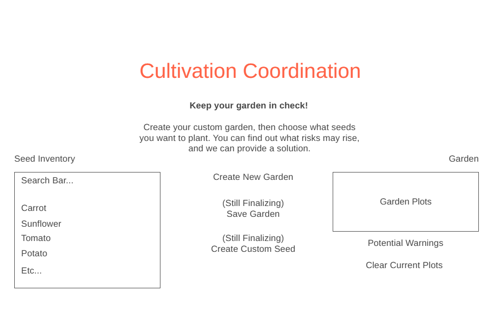

# TODO: 
- [x] functionality to save Plots to DB (including plant info)
- [ ] User accounts (login, register, (connect saved Plots to user))
- [x] get plant info from real plant API, and store it in database
- [ ] (name, scientific name, sunlight, avg height, avg width, germination to harvest time, planting zone) to replace mock data.
- [x] Search bar to search for plants (replace Request Scientific Plant Names button)
- [x] Make sure to update seeds list so searched plants can be added to garden.
- [ ] Check to make sure all plants in a plot are compatible with each other.(similar sunlight) highlight in red when different(eventually, check all catagories.)
### SERVER: 
- [x] create a Plots table to store plot info.
- [ ] create a table for User info
- [ ] update User info to connect saved Plots to user
- [x] update plants to real plant API info
- [ ] update plants to connect to Plots user has many plots, plots have one user. plots have many plants, plants belong to many plots.
    

## Project Overview
- ***Project Name & Tagline***: Cultivation Coordination. Keep your garden in check!

- ***Problem Statement***: Gardening can be challenging for some. Plants may need certain conditions that isn't suitable for others, such as room, sunlight, or soil alkalinity. It can be hard for some gardeners to keep in mind, as what they plant may end up hurting their garden. This app is designed to help ease this challenge, as it brings a way to help coordinate your planting locations in your garden. Users will be able to choose how big they want their garden to be by dragging over boxes that act as plots (think of excel), then they can choose from a variety of seeds to plant them in their garden and see where they would best be planted. Each seed will have a variety of info, such as alkalinity, sunlight, and space, and based on how they plant their garden, the app will show if the garden is suitable, or if problems may arise based on the seeds info. Ex. the app may warn about putting potatoes close to tomatoes, as they both may increase the risk of disease. This app can help users plan their garden while making sure to follow each plant's needs to keep their garden healthy.

- ***Target Users***: This app is targeted towards gardeners. It may be especially helpful for new gardeners, but it can also be nice for experienced gardeners as well.

## Feature Breakdown
- ***MVP Features***: The core functionality of this project is to allow users to create a custom garden based on their desired garden size and showcase a variety of plant seeds for their garden. The database to hold plant info, and allowing users to create their garden size using boxes as plots may be completed in the first sprint or two. Recommendations/warnings could also be implemented in this time frame, but it may happen last.

- ***Extended Features***: Recommendations/warniings could happen the later phases if we don't have enough time. We're still discussing this but maybe a garden that a user creates can be saved to a database so they can come back to it later. This feature is also still beng discussed, but maybe the user can create a custom seed of their own, since we may not have all plant info available. They can input the seed's specific information and once they submit it, it can be stored to a database. Then, the user can use their custom seed.

## Data Model Plannng
- ***Core Entities***: The main data object is going to be a database of all the plant info. Ex. potato with a specific ID, recommended sunlight, alkilinity, space, and known diseases. This info will be stored and once the user chooses the seed, the API will be called to bring the seed to the chosen plot and it's associated information. Based on the information, warnings will be shown to the user.

- ***Key Relationships***: Data will be stored in catagories, such as sunlight, alkalinity, space, attracts/repels pests, germination to harvest time, and diseases. Each plant can belong to multiple catagories, and each catagory can have multiple plants. This allows for a more efficient search process, as the user can search for plants based on their needs, and the app can check specific catagories for similar plants.

## User Experience
- ***User Flows***: The user will accomplish tasks by first creating their custom garden size using boxes as plots, just like excel, where each plot represents a fixed amount of feet. Then, the user will be able to plant a seed in each plot. Based on what they plant, a warning can pop up about potential risks and what the user should do to fix it.

- ***Wireframes/Sketches***: 

## CI/CD Workflow
- ***CI Workflow***: This is a GitHub Actions workflow that automatically runs all of our tests on either pushes to main or a pull request to main. There are 4 jobs that run: backend-unit, frontend-unit, integration, and playwright. These jobs run all the unit tests, integration tests, and E2E tests. The workflow fails if any tests fail, and integration relies on both unit tests to pass and playwright relies on integration to pass. Each job runs on ubuntu-latest, and they all utilize npm scripts in order to run the tests. Both integration and playwright jobs have set up a testing database to run their tests. The playwright job installs playwright browsers in order to run. Test results will be shown on the GitHub Actions tab. 

- ***CD Workflow*** This is a GitHub Actions workflow that automatically deploys to our VM (our orange pi). First, the CI Workflow must be completed, and code must be merged into main. Then, the CI Workflow must be successful; all the tests must pass. Once this happens, it will connect to the VM by installing Tailscale and using the necessary GitHub secrets to access the VM with SSH. Finally, it runs a script to access the VM, pull the merged changes, and restart both Docker and the tailscale funnel in order to run all recent changes. 